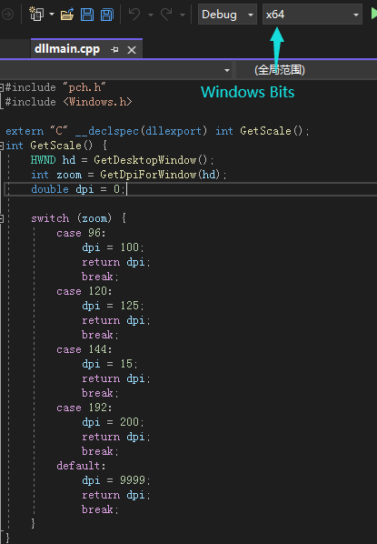

# Display lessons

A tool to display the current course in the upper left corner of the computer, condensation is the essence!

一个用来在电脑左上角显示当前课程的工具，浓缩才是精华！

## Important Something
1. *System*
    - support
        > Windows 8 or 8.1
        1. Windows 8 64 bit
        2. Windows 8 32 bit
        3. Windows 8.1 64 bit
        4. Windows 8.1 32 bit
        > Windows 10
        1. Windows 10 64 bit
        2. Windows 10 32 bit
        > Windows 11
        1. Windows 11 64 bit
        2. Windows 11 32 bit
        > AND HIGHER
    - unsupport
        > Windows 7
        1. Windows 7 **SOME VERSION**
            > Reason: DLL **cannot work**
        > OR LOWER
2. *File structure*
    - Libs
        1. function
            > Save some program **necessary** function.\
            保存一些程序**必要的**函数
        2. resource
            > Save and read some program **necessary** resource package.\
            保存和读取一些程序**必要的**资源包
        3. other file
            > autoexec.cfg\
            super.pyl -> plugins\
            timer.pyl -> plugins\
            SYSTEM_WIN32.dll -> Get Windows DPI dll(64 bit)\
            SYSTEM_WIN64.dll -> Get Windows DPI dll(32 bit)\
            >> DLL resource code(Lan: C++)\
            DLL 源代码(语言：C++)\
           